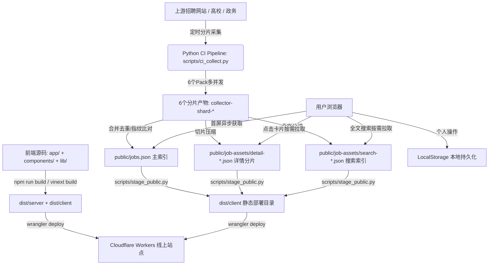

# 职讯雷达 (Job Radar) · AI 项目交接与上下文备忘录

> **适用对象**：后续接手本项目的任何 AI 助手（Claude, ChatGPT, Cursor, Copilot, Antigravity 等）或新开会话。  
> **使用方法**：接手本项目时，**优先通读本文档**，可直接掌握全部架构设计、数据流、踩坑规避点与验证命令，避免重复排查与设计偏离。

---

## 2026-09-21：Actions 节省分钟变更（覆盖下文旧 NAS 交接说明）

提交仅运行轻量检查；定时改为每天 16:00。主矩阵高校分片现在直接运行于 NAS，不再让云端轮询子任务；这是本轮节省分钟的明确调整。NAS 离线会排队，需取消并手动跳过高校分片。仅发页面使用 `deploy_only`，按哈希复用线上真实快照。具体开关与限制见 [docs/actions-cost-control.md](docs/actions-cost-control.md)。用户要求本地只做定向验证，不执行全量测试；下文旧全量验证要求不适用。

## 1. 项目速览 (Project Overview)

- **项目定位**：个人招聘信息聚合看板（权威高校就业网、政务直聘、大型国企/银行招聘公告聚合与结构化检索）。
- **线上部署地址**：`https://sites-project.job-radar.workers.dev`
- **代码仓库路径**：
  - 工作区根目录：`d:/code/get_job`
  - **Git 仓库实际位置**：`d:/code/get_job/web`（所有的 git 命令、npm 命令、python 脚本均在此目录下执行）。
- **核心技术栈**：
  - **前端**：`Vinext` (基于 Vite 8 的 Next.js 兼容框架) + `React 19` + `TypeScript` + `Tailwind CSS 4` + 自定义设计系统规范。
  - **采集与数据管线**：`Python 3.12`（无头解析、多源抓取、去重归并、分片校验）。
  - **托管与发布**：`Cloudflare Workers`（Sites 静态托管与边缘分发，通过 `wrangler 4.92` 部署）。
  - **定时流水线**：GitHub Actions（每天北京时间 16:00 自动分片采集、构建与部署）。

---

## 2. 核心架构与数据流 (Architecture & Data Flow)



### 数据交互与静态化设计
1. **轻量主索引与分片加载**：
   - `jobs.json` 仅包含卡片筛选必须的元数据（标题、企业、发布/截止日期、地点、类型、届别、标签）。
   - `detail-*.json` 按 ID 前两位哈希分片，仅当用户点击“查看详情”时按需请求，不污染首屏带宽。
   - `search-*.json` 全文索引，仅当用户在搜索框输入关键词时异步拉取。
2. **纯前端免登录持久化**：
   - 用户的收藏、已投递、不感兴趣、阅读时间、筛选条件均保存在当前浏览器的 `localStorage` 中。
   - 网站本身无后端数据库，保证免登录、隐私安全与极低维护成本。

---

## 3. 关键目录结构与核心文件导览 (Key Files Map)

| 目录/文件 | 核心职责与设计要点 |
| :--- | :--- |
| [web/app/page.tsx](file:///d:/code/get_job/web/app/page.tsx) | 核心主页面。负责客户端 Hydration、异步加载 `jobs.json`、筛选、排序、分页与多视图（卡片/表格）呈现。 |
| [web/app/error.tsx](file:///d:/code/get_job/web/app/error.tsx) | 路由段级客户端错误边界，提供中文友好容错卡片（重试、清空缓存）。 |
| [web/app/global-error.tsx](file:///d:/code/get_job/web/app/global-error.tsx) | 根布局级全局错误边界，接管 Vinext 默认的英文未捕获异常白屏。 |
| [web/components/job-card.tsx](file:///d:/code/get_job/web/components/job-card.tsx) | 招聘卡片组件。支持薪资高亮、截止倒计时、生命周期徽章、多渠道同步折叠、快捷复制分享。 |
| [web/components/personal-radar.tsx](file:///d:/code/get_job/web/components/personal-radar.tsx) | 个人雷达组件。顶部快捷聚焦（今日新发、新开补录、3天内截止、近期变更）与预设管理。 |
| [web/lib/jobs.ts](file:///d:/code/get_job/web/lib/jobs.ts) | 领域模型与核心算法：`filterJobs`、`mergeDuplicateOpportunities`、`locationMatch`、`extractSalary` 等。 |
| [web/lib/radar.ts](file:///d:/code/get_job/web/lib/radar.ts) | 雷达统计指标与预设方案计算逻辑。 |
| [web/lib/browsing.ts](file:///d:/code/get_job/web/lib/browsing.ts) | 本地浏览喜好安全还原（防范损坏的 LocalStorage 导致崩溃）。 |
| [web/scripts/collect.py](file:///d:/code/get_job/web/scripts/collect.py) | 核心采集器与适配器池（包含各高校、人社局、国企银行等几十个爬虫）。 |
| [web/scripts/ci_collect.py](file:///d:/code/get_job/web/scripts/ci_collect.py) | CI 调度驱动器。控制多分片执行、超时退避、轮换排期与分片合并。 |
| [web/scripts/stage_public.py](file:///d:/code/get_job/web/scripts/stage_public.py) | 校验哈希并把最新快照挂载到构建好的 Cloudflare 部署目录。 |
| [web/.github/workflows/daily-collect.yml](file:///d:/code/get_job/web/.github/workflows/daily-collect.yml) | GitHub Actions CI/CD 流水线定义。 |

---

## 4. 关键设计契约与必须遵守的铁律 (Critical Invariants & Gotchas)

### 规则 1：客户端 Hydration 防御（极易踩坑！）
- **SSR 与 Client 隔离**：`Home` 组件初次挂载时 `data` 为 `null`，`useEffect` 触发 `fetch('/jobs.json')` 异步加载数据。
- **来源状态可选性（Optional Properties）**：
  在 `jobs.json` 的 `sources` 列表中，因轮转休眠或限流冷却，很多来源的 `status` 为 `'deferred'` 或 `'blocked'`，**其 `errors` 数组可能为空或被省略**。
  - ❌ **绝对禁止**：`s.errors.length > 0`（会导致未捕获的 `TypeError: Cannot read properties of undefined`，整站崩溃！）。
  - ✅ **标准写法**：`Boolean(s.errors && s.errors.length > 0)`，数值必须带默认值：`s.pages ?? 0`、`s.discovered ?? 0`。

### 规则 2：SDEI 高校源防护策略
- 山东高校就业平台（`school.gxjy.sdei.edu.cn`）共享同一入口与 IP 限流策略。
- **4 组轮转**：17 所高校分为 4 组轮转，每天仅全量扫描 1 组，其余高校休眠（`deferred`）保留历史数据。
- **岗位接口按需联动**：仅当某高校的“招聘公告”本轮发现新增或内容变动时，才去触发请求“具体岗位”接口；无更新时岗位接口自动 `deferred`。
- **持续冷却机制**：一旦遭遇 403/420，记录 `blocked_until`（至少冷却 4 小时），后续采集直接跳过该主机，严禁暴力重试。

### 规则 3：LocalStorage 存储键规范
所有保存在浏览器端的键名均带版本后缀，读写必须用 `try...catch` 包裹：
- `job-radar-browsing-v1`：筛选条件、卡片/表格视图模式、合并同企业开关。
- `job-radar-page-size-v1`：每页条数（20 / 50 / 100）。
- `quancheng-personal-v1`：个人收藏、已投递、不感兴趣、阅读时间戳。
- `quancheng-last-visit-v1`：上一次访问时间戳（用于计算“新收录”提示）。
- `job-radar-presets-v1`：个人雷达预设方案列表。
- `job-radar-active-preset-v1`：当前激活的雷达预设 ID。

### 规则 4：安全规则（全局规范）
- **未经用户明确指令，绝不执行 `git push`**。
- **不得擅自丢弃或覆盖现有代码或修改**（禁止危险的 `git reset --hard`、`git clean` 等）。

---

## 5. 黄金验证命令手册 (Verification Cheat Sheet)

每次完成代码修改后，务必在 `d:/code/get_job/web` 目录下执行以下验证套件：

```powershell
# 1. 运行前端全量单元测试 (52项测试，毫秒级完成)
node --experimental-strip-types --test tests/*.test.ts

# 2. 运行 Python 采集与数据校验测试 (95项测试)
python -m unittest discover -s tests -p 'test_*.py'

# 3. 代码风格与 Lint 检查 (oxlint)
npm run lint

# 4. TypeScript 类型校验 (严格模式)
npx tsc --noEmit

# 5. 生产构建打包验证 (Vinext + Vite)
npm run build
```

---

## 6. 最近重要演进记录 (Recent Changelog & Context)

- **`664d120`**：解决 SDEI 高校上游 HTTP 403 封禁问题。引入慢速专用通道（3~5s 随机抖动）、4 组高校轮流扫描机制、第一页内容指纹首屏早停。
- **`0fa71e6`**：落实审计反馈。实现 `blocked_until` 跨 Action 持久化冷却；修复岗位接口按需触发门禁（公告无更新则不扫岗位）；强化早停安全条件。
- **`53ce741`**：**修复线上白屏崩溃问题**。
  - 根因：`deferred` 轮转来源的元数据未包含 `errors` 属性，客户端解析引发 `TypeError`。
  - 修复：前端全链路可选链与空值保护；CI 采集补齐结构；新增 `app/error.tsx` 与 `app/global-error.tsx` 错误恢复边界。

---

## 7. 常见接手任务与指引 (Quick Recipe for Common Tasks)

### 采集续页与共享限速（2026-09-16）

- 2026-09-18：SDEI 具体岗位必须通过真实 `edit1` 详情解析，不能用列表 `inline_html` 充当详情核验。`detail_verification=verified` 才能公开；旧的未核验记录、详情失败记录保留内部状态与待续队列，但不进入主索引、详情分片或搜索索引。正常详情提取 `.info-item`，补齐单位、专业和公开投递方式，排除学校页脚联系方式。发布 `raw_records` 计可公开原始记录，`withheld_records` 计隐藏记录；历史完整性仍检查内部 state，不可因公开隐藏而删除历史。回归测试见 `tests/test_position_verification.py`。

- NAS 首次云端运行 #45 的交接失败源于子工作流同时定义 `NO_PROXY` / `no_proxy`，被 GitHub 判定为重复 env 键，任务未派发。保留 env 中大写变量，在 shell 内 export 小写别名。工作流需用 actionlint 校验，普通 YAML 解析不足以发现 Actions 语义错误；自定义标签配置在 `.github/actionlint.yaml`。交接报告现区分 HTTP 接口错误、接单超时、执行超时与缺失产物，并提供子任务链接；不打印签名 URL 或令牌。

- NAS 分流为显式启用：仓库变量 `UNIVERSITIES_B_RUNNER=nas`。主矩阵仍在 GitHub 上，由 `scripts/nas_dispatch.py` 调度独立 `nas-universities.yml`，绑定父任务 ID/attempt/commit，获取同一基线。NAS 约 90 秒未接单或执行超过 1100 秒则取消子任务、保留高校历史，其他分片不被无限排队阻塞。不要直接把主矩阵的 runs-on 改为 self-hosted。
- 绿联 DH4300 Plus 为 ARM64；使用新的 `compose.nas-runner.yml` 和 `deploy/nas/`，不要使用旧的全站 NAS Dockerfile。NAS 不需要 Cloudflare 密钥或访问 workers.dev；通过 GitHub 产物交换基线及增量。原有分片基线/归属校验不变。启用前须实测家庭宽带直连高校、GitHub 联通及容器构建；当前本地 Docker 守护进程未启动，尚未实际构建 ARM64 镜像或接入 NAS。

- SDEI 请求失败记录 `request_diagnostic`（阶段、去除查询参数的地址、方法、状态码和耗时），不保存 Cookie、响应正文或认证参数。CI 报表区分“请求被拒绝”和“共享冷却跳过”；没有成功核验的分片不再宣称允许发布。
- 单源同会话诊断：`python scripts/diagnose_sdei.py --source jobsdufe-announcements --state data/state.json`。必须使用最新状态并遵守冷却；只读取一页，不采详情、不发布、不修改状态。`--network-route direct` 仅该进程直连，不修改系统代理。成功只表示该环境能读取列表，不保证 GitHub 云端可用。
- 2026-09-16 诊断：当前电脑 Edge、采集程序及单次直连均收到平台 403；用户确认手机移动网络可以显示招聘公告。当前不能据此宣称接口已修好，也不能保证换 NAS 就成功；需在可正常访问的网络验证同会话列表和详情，再决定采集运行位置。

- 预热请求遇到 403/420/429 时必须同步共享冷却并向上抛出，禁止继续调用招聘接口；普通预热超时或 404 仍可容错。`HostPaused.retry_after_seconds` 传递剩余等待时长，写入 `blocked_until` 时不得缩短有效的 `Retry-After`，仍保留至少 4 小时的跨运行冷却。
- CI 故障模拟测试捕获标准输出/错误输出，并断言预期告警；`GITHUB_STEP_SUMMARY` 必须隔离。不要让测试的 `::warning::` 污染真实 Action 告警。相关回归测试包括 `tests/test_cooling_contract.py`；本轮完整 Python 套件为 122 项。

- 可按页码访问的公告源保存 `resume_page`：预算至少为 2 页时，每轮刷新首页后续采；预算为 1 页时逐页推进。默认 5 页预算保留一页重叠。到末页或日期窗口边界后重新开始扫描。
- `list_complete` 表示本轮到达扫描边界；跨多轮才到达末页时，`early_exit_safe=false`，下一轮继续扫描，避免新公告插入中间页后被首页早停遗漏。`pending` 仍负责已发现但未完成的详情。
- 每个列表页读取后保存检查点，CI 超时恢复会保留该页发现的公告及续采游标；休眠/冷却来源必须保留 `PAGINATION_FIELDS`。
- CI 通过 `--rate-state data/host-pacing.sqlite` 给同一分片的所有来源进程共享请求间隔与运行期间的冷却。SQLite 事务协调并发，进程退出后锁自动释放。此文件无需发布；跨 Action 的冷却仍由 `state.json` 中的来源状态承载。
- 独立编号公告源使用续采；企业在架岗位清单仍使用完整单轮校验，以免局部扫描造成错误下架。SDU 的下一页链接和 OfferJack 的城市轮询未改为数字游标。
- 新回归测试位于 `tests/test_resume_and_pacing.py`，包含多轮续采、失败重试、超时恢复和真实独立子进程限速测试。

1. **若需要新增采集来源**：
   - 在 `web/scripts/collect.py` 的 `SOURCES` 添加来源定义（含 `adapter`, `trust`, `scope` 等）。
   - 在 `web/scripts/collect.py` 的 `SOURCE_PACKS` 分配其归属的 pack。
   - 运行 `python -m unittest tests.test_pipeline_reliability` 验证分片分配唯一性。
2. **若需要调整页面 UI 或样式**：
   - 主体样式集中在 `web/app/globals.css`。
   - 遵循现有的设计系统变量（如 `--primary`, `--border`, `--muted` 等），不要随意硬编码未统一样式。
3. **若需要调试线上数据异常**：
   - 直接读取快照数据：`https://sites-project.job-radar.workers.dev/jobs.json`。
   - 本地模拟还原快照：`python scripts/ci_collect.py prepare --site https://sites-project.job-radar.workers.dev`。
